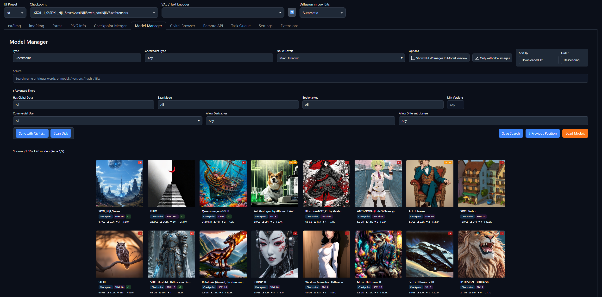
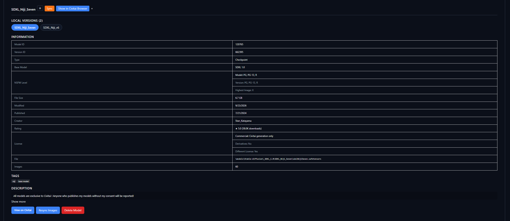
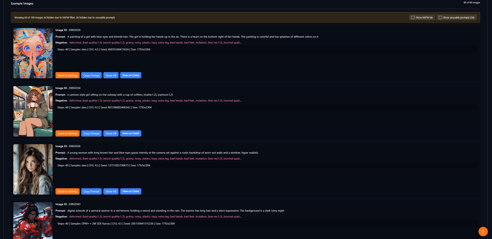
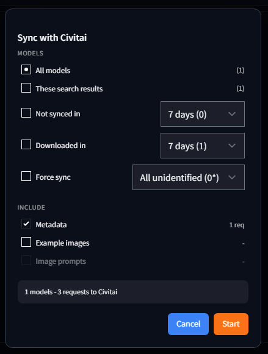
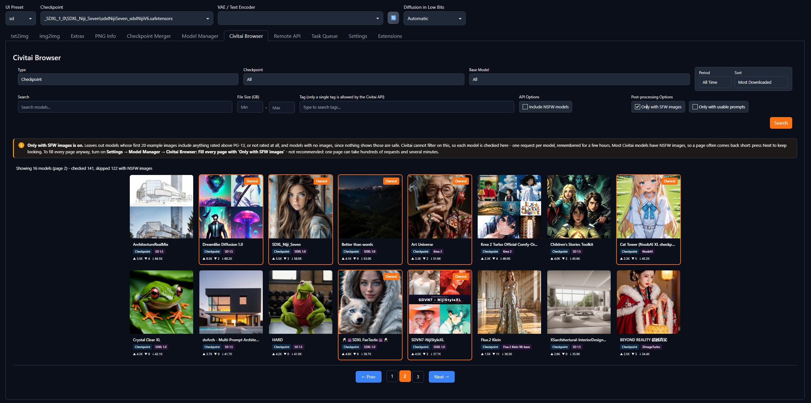
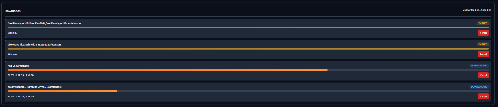
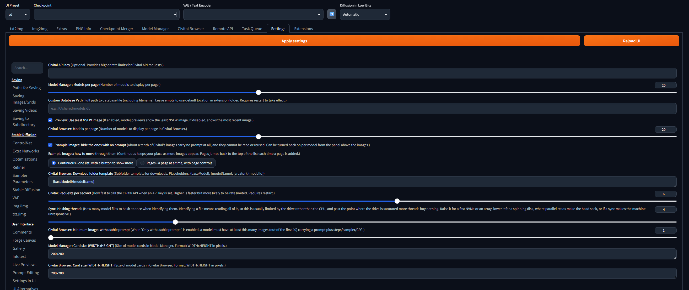

# SD WebUI Forge Model Manager

A model management extension for Stable Diffusion WebUI Forge. It indexes your local
models, enriches them with Civitai metadata, and adds a Civitai browser you can download
from without leaving the WebUI.

Two tabs are added: **Model Manager** and **Civitai Browser**.

https://github.com/user-attachments/assets/d8bcf3ad-4959-4739-9e0f-b2693852161f

## A look around

### Your library, at a glance

Every model on disk in one grid, with its Civitai preview. Filter by type, base model,
NSFW level, licence terms and more, then sort by name, size, rating, downloads or date.



### Everything about a model, in one panel

Click a card for its trigger words, tags, description, creator, licence terms and the
NSFW breakdown of its gallery. Versions of the same model are grouped, and a selector
switches between them.



### Example images you can reuse

The model's Civitai gallery, with each image's prompt and settings. One click sends them
to txt2img, with the sampler, scheduler, VAE and LoRAs matched against what you have
installed. A banner says how many images are hidden as NSFW or for having no usable
prompt, with a switch for each.



### Keeping it in sync

**Scan** finds new files on disk. **Sync** identifies them by hash and fetches their
Civitai metadata, and says what it is about to do before it does it.



### Finding new models

Search Civitai without leaving the WebUI, by name, type, base model, tag and file size.
Models you already have are marked **Owned**, with a jump to them in the Model Manager.
Two checks Civitai cannot make are done here: **Only Show Models with SFW images** leaves out models
whose first example images include anything NSFW, and **Only with usable prompts** keeps
only models whose images have a prompt worth reusing. Results stream in as they are found.



### Downloading into the right folder

Downloads run in parallel with progress, land in the folder for their model type, and
are synced into your library as soon as they finish.



## Model Manager

Browse and organize the models already on disk.

- **Grid view** with thumbnails, configurable card size, and paginated loading
- **Filters**: search, type, base model, NSFW level (max or contains mode), Civitai data
  present, bookmarked, minimum version count, and licence terms (commercial use,
  derivatives, different licence)
- **Type from the file itself**: Scan Disk reads each file's tensor names and shapes, so a
  VAE shared on Civitai as a "Checkpoint" is filed as a VAE, LoRA formats are told apart
  (LORA, LoCon, LoHa, LoKr, DoRA, LyCORIS Full), and files Civitai does not know get a
  type too. `.ckpt` and `.pt` files are read without running anything in them. Until a
  file has been scanned, its Civitai type is used
- **Sort** by name, file size, file modified, published, scanned, downloaded, updated,
  rating, or download count
- **Version grouping**: versions of the same model are grouped, with a version selector
  in the details panel
- **Details panel**: trigger words, tags, description, creator, rating, per-level NSFW
  breakdown, licence terms, and the full Civitai image gallery with generation parameters
- **Send to txt2img** from any gallery image, including sampler, scheduler, VAE,
  and resource matching against your installed models. For Flux, Qwen-Image, Wan and
  Forge Neo's other newer models it also switches the UI preset and selects the text
  encoders and VAE the model needs, read from the model file itself. In a LoRA's or a
  VAE's gallery that model is the image's own checkpoint when you have it, else the
  LoRA's, else the image's checkpoint as Civitai describes it (asked once, remembered)
- **Bookmarks**, per-model force re-sync, and model deletion (removes the model plus its
  sidecar metadata and preview files)
- **Scan** finds new model files on disk; **Sync** fetches Civitai metadata by file hash

## Civitai Browser

Search Civitai and download directly into the right model folder.

- Search by query, type, base model, tag, period, and sort order, with results streamed
  in as they are found
- **Ownership detection**: models you already have are marked as owned, with a
  "Show in Model Manager" jump
- **Usable-prompt filter**: only show models whose images carry a prompt plus
  steps/sampler/CFG
- Image gallery with pagination and cached results
- **Downloads**: parallel queue with progress, configurable destination folder template,
  automatic metadata sync when the download finishes, and a WebUI model-list refresh

## Installation

1. Open SD WebUI Forge
2. Go to **Extensions** -> **Install from URL**
3. Paste: `https://github.com/therestlesscat/sd-webui-forge-model-manager.git`
4. Click **Install**
5. Restart the WebUI

`blake3` is installed automatically on first run; it is optional and only used as a hash
fallback.

## Usage

1. Open the **Model Manager** tab
2. Click **Scan** to index the models on disk, then **Sync** to fetch Civitai metadata
3. Set your filters and click **Load Models**
4. Click any model card to open its details

## Settings

Found under **Settings -> Model Manager**.



| Setting | Default | Description |
|---------|---------|-------------|
| Civitai API Key | empty | Optional. Higher rate limits for Civitai API requests; without one, image prompts cannot be fetched and some models refuse to download |
| Model Manager: Models per page | 20 | Model Manager page size (5-50) |
| Custom Database Path | empty | Full path to the database file. Empty uses the extension folder. Requires restart |
| Preview: Use least NSFW image | on | Off shows the most recent image instead |
| Civitai Browser: Models per page | 20 | Civitai Browser page size (5-50) |
| Example images: hide the ones with no prompt | on | Hides images with no prompt to read or reuse. Can be turned back on per model from the banner above the images |
| Example images: how to move through them | Continuous | Continuous grows one list with a button to show more; Pages shows a page at a time |
| Civitai Browser: Download folder template | `_{baseModel}/{modelName}` | Placeholders: `{baseModel}`, `{modelName}`, `{creator}`, `{modelId}` |
| Civitai: Requests per second | 6 | API call rate when an API key is set (1-10). Requires restart |
| Sync: Hashing threads | 4 | Files hashed at once when identifying them (1-16). Raise for fast NVMe, lower for a spinning disk |
| Civitai Browser: Minimum images with usable prompt | 1 | How many of a model's first 20 images need a usable prompt for "Only with usable prompts" |
| Civitai Browser: Fill every page with 'Only Show Models with SFW images' | off | Not recommended. Keeps searching until the page is full instead of stopping after a few dozen checks; one page can take hundreds of requests |
| Model Manager: Card size | `200x280` | Card size in pixels, `WIDTHxHEIGHT` |
| Civitai Browser: Card size | `200x280` | Card size in pixels, `WIDTHxHEIGHT` |
| Send to txt2img: *model* text encoders and VAE | empty | One per Forge Neo preset: Flux.1 / Chroma, Flux.2 Klein, Lumina Image 2.0, Z-Image, Anima, Wan, Qwen-Image, Krea 2, ERNIE-Image, PiD. File names to select for that preset's models, comma-separated. Empty picks the highest-precision file installed; name an fp8 or GGUF file to use a smaller one. Each setting says what the model needs and links to the files |

### Text encoders and VAEs for newer models

Flux, Qwen-Image, Wan and the other newer models Forge Neo runs need text encoders and a
VAE that an image's generation data never names. Put text encoders in
`models/text_encoder` and VAEs in `models/VAE`. Forge Neo's
[Download Models](https://github.com/Haoming02/sd-webui-forge-classic/wiki/Download-Models)
page lists them all.

| Preset | Needs |
|--------|-------|
| Flux.1 / Chroma | CLIP-L, T5-XXL, Flux VAE (`ae`). Chroma: T5-XXL and `ae` only |
| Flux.2 Klein | Qwen3 4B (4B) or Qwen3 8B (9B), Flux.2 VAE |
| Lumina Image 2.0 | Gemma 2 2B, Flux VAE (`ae`) |
| Z-Image | Qwen3 4B, Flux VAE (`ae`) |
| Anima | Qwen3 0.6B, Qwen-Image VAE |
| Wan | UMT5-XXL (Hugging Face layout), Wan 2.1 VAE |
| Qwen-Image | Qwen2.5-VL 7B, Qwen-Image VAE |
| Krea 2 | Qwen3-VL 4B, Qwen-Image VAE |
| ERNIE-Image | Ministral 3 3B, Flux.2 VAE |
| PiD | Gemma 2 2B IT; the VAE depends on the model |

When nothing is set, Send to txt2img uses Forge's saved choice for the preset if it is
the right kind of file, and otherwise the file with the highest precision. A file named in
the settings comes before both. A missing module, or a named file Forge does not list, is
reported in a notice.

## Data storage

Metadata lives in a SQLite database (`models.db` in the extension folder by default).
Sidecar files written next to each model stay compatible with other Civitai extensions:

```
model.safetensors
model.civitai.info     <- model + version metadata
model.preview.png      <- thumbnail
```

## NSFW levels

The extension uses Civitai's NSFW levels: PG, PG-13, R, X, XXX, Blocked.

The effective level for a model is the maximum of:

- Model-level NSFW rating
- Version-level NSFW rating
- Highest image NSFW rating

## License

MIT License - see [LICENSE](LICENSE).
