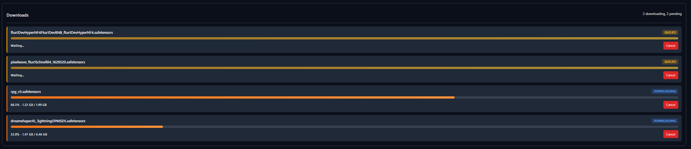
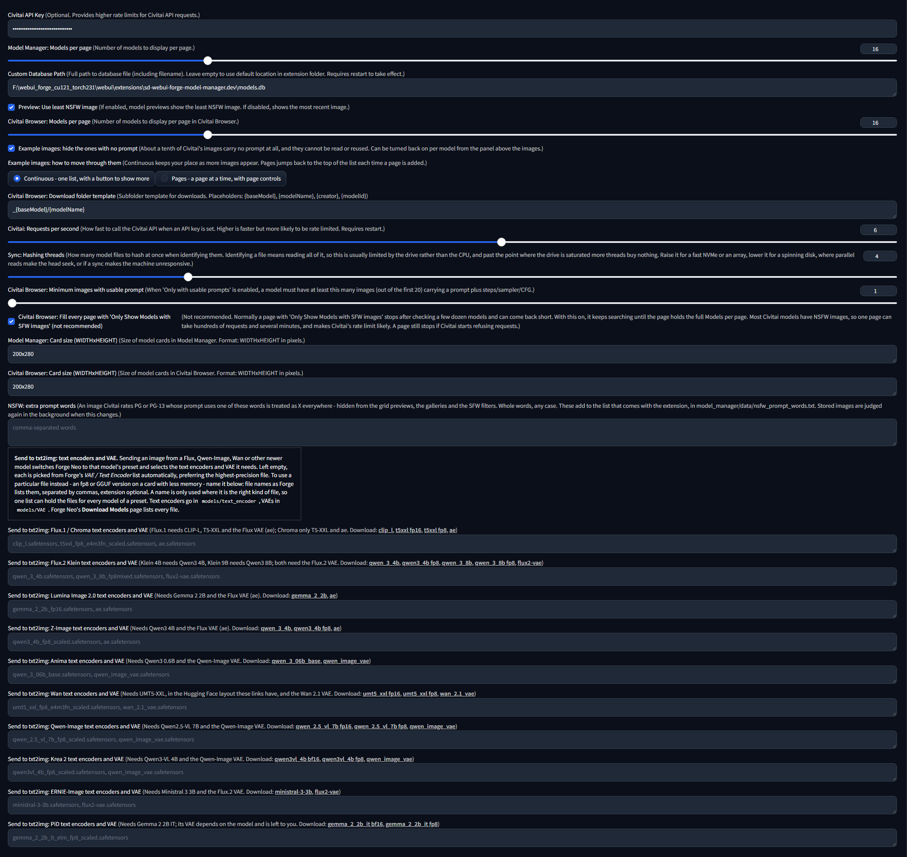

# SD WebUI Forge Model Manager

A model management extension for Stable Diffusion WebUI Forge - both Forge Neo and the
original Forge. It indexes your local models, enriches them with Civitai metadata, and
adds a Civitai browser you can download from without leaving the WebUI.

Two tabs are added: **Model Manager** and **Civitai Browser**.

https://github.com/user-attachments/assets/7d7a97c0-7513-42da-a954-bf23b3f74a96

[Watch it in better quality on YouTube](https://youtu.be/HCHe44Yp-QU)

## What's new

**0.42 - Grouping in two levels.** The Generations tab's Group by is a menu, and groups
by two things at once: a model, then the prompts used with it; a day, then the models; any
two of prompt, model, LoRA combination, size and day. A click on a grouping groups by it;
its "then by" list, beside it on hover, adds the second. The grid is then in sections - a
header row for each model, say, with its prompts' groups under it - and a group opens
straight onto its batches.

**0.41 - Notes to you, per release.** The tabs say what is new, and what to do after an
update, in a note at the top of the tab it concerns: a feature worth knowing, something to
do once - with a button that does it, such as opening Scan Disk with the right box ticked -
or a warning. One click dismisses a note for every browser using the database; the
settings window's "What's new" keeps them all. A fresh install sees only what is for
everyone.

**0.40 - Generations.** A new tab, before the Model Manager, with every image you have
generated, newest first, whatever model made it. Each generation is a tile - a batch shows
its first four images and how many there are, and opens out in place - and the grid loads
on as you scroll. A click opens the image large, with the arrow keys or the wheel to step
through them all and its prompt and settings beside it. Sending one back to txt2img or
img2img sets Forge up as it was made: its preset, checkpoint, text encoders and VAE.

**0.30 - Your generations.** Every image you generate and save is recorded - the prompt
as you typed it, the infotext written into each file, every setting and the arguments of
each extension - and filed under every model it used, LoRAs included. A model's gallery
gets a second tab beside its Civitai images, with your own generations with it: a card
per generation, its images opening full size, and a button that sends its settings back
to the tab it was made in. Only images generated from now on are recorded; a setting
turns it off.

**0.20 - A settings window.** A gear in the header of both tabs opens one window for
all the extension's settings, grouped by what they are for, with search, and showing only
the options that apply to what else is chosen. Card sizes are set with a preview: a row of
real cards from that tab, at the size being set. The download folder shows where an
example model would be saved as you type. The text encoders and VAE for Flux, Qwen-Image,
Wan and Forge Neo's other newer models are chosen from the files actually installed, and
a file chosen for one model is offered to the others that use it. The API key can be
tested before it is saved. Everything is saved to the WebUI's own settings, so
**Settings -> Model Manager** stays in step.

**0.18 - A trained model judges prompts.** Civitai's raters miss some explicit images and
rate them PG or PG-13, and every SFW view used to show them. A model trained on a pull
of Civitai now reads each image's prompts, negative prompt, ADetailer and hires prompts,
and the resources it used, and raises the explicit ones to X - in the grid previews, both
galleries and the SFW filters. How far it goes is a setting; at the default it caught
about 94% of explicit prompts on a library it had never seen. The word list still applies
alongside it, and can be chosen instead.

Every change, version by version, is in [CHANGELOG.md](CHANGELOG.md).

## A look around

### Your library, at a glance

Every model on disk in one grid, with its Civitai preview. Filter by type, base model,
NSFW level, licence terms and more, then sort by name, size, rating, downloads or date.


### Everything about a model, in one panel

Click a card for its trigger words, tags, description, creator, licence terms and the
NSFW breakdown of its gallery. Versions of the same model are grouped, and a selector
switches between them - including the versions you have not downloaded, as Civitai listed
them at the last sync, each with a Download.


### Example images you can reuse

The model's Civitai gallery, with each image's prompt and settings. One click sends them
to txt2img, with the sampler, scheduler and VAE matched against what you have installed,
and the image's LoRAs and embeddings laid out as chips under the prompts: click one to
put it in the prompt or take it out, or to download it if you do not have it. A banner
says how many images are hidden as NSFW or for having no usable prompt, with a switch
for each.


### Your own generations

Beside a model's Civitai images, a tab of the images you have generated with it - with
the checkpoint, or with any LoRA, text encoder or VAE it used. Each generation is one
card: its image, or its batch as a grid, with the settings from its infotext. Send puts
them back in txt2img or img2img as Forge's PNG Info would; Delete removes the record, and
the image files too if you tick the box beside it. Recording starts once the extension is
installed, and can be turned off in its settings.

### Keeping it in sync

**Scan** finds new files on disk. **Sync** identifies them by hash and fetches their
Civitai metadata, and says what it is about to do before it does it.


### Finding new models

Search Civitai without leaving the WebUI, by name, type, base model, tag and file size.
Models you already have are marked **Owned**, with a jump to them in the Model Manager.
Two checks Civitai cannot make are done here: **Only Show Models with SFW images** leaves out models
whose first example images include anything NSFW, and **Only with usable prompts** keeps
only models whose images have a prompt worth reusing. Results stream in as they are found.


### Downloading into the right folder

Downloads run in parallel with progress, land in the folder for their model type, and
are checked against Civitai's SHA-256. A download is complete once the model is in your
library, so it can be opened in the Model Manager straight away.



## Model Manager

Browse and organize the models already on disk.

- **Grid view** with thumbnails, configurable card size, and paginated loading
- **Filters**: search, type, base model, NSFW level (max or contains mode), Civitai data
  present, bookmarked, minimum version count, and licence terms (commercial use,
  derivatives, different licence)
- **Type from the file itself**: Scan Disk reads each file's tensor names and shapes, so a
  VAE shared on Civitai as a "Checkpoint" is filed as a VAE, LoRA formats are told apart
  (LORA, LoCon, LoHa, LoKr, DoRA, LyCORIS Full), and files Civitai does not know get a
  type too. `.ckpt` and `.pt` files are read without running anything in them. Until a
  file has been scanned, its Civitai type is used
- **Sort** by name, file size, file modified, published, scanned, downloaded, updated,
  rating, or download count
- **Version grouping**: versions of the same model are grouped, with a version selector
  in the details panel. It lists every version Civitai has, as of the last sync, with the
  ones you have marked; one you do not have shows its details and a Download, followed in
  the same downloads panel as the Civitai Browser's
- **Details panel**: trigger words, tags, description, creator, rating, per-level NSFW
  breakdown, licence terms, and the full Civitai image gallery with generation parameters
- **Send to txt2img** from any gallery image, including sampler, scheduler, VAE,
  and resource matching against your installed models. For Flux, Qwen-Image, Wan and
  Forge Neo's other newer models it also switches the UI preset and selects the text
  encoders and VAE the model needs, read from the model file itself. In a LoRA's or a
  VAE's gallery that model is the image's own checkpoint when you have it, else the
  LoRA's, else the image's checkpoint as Civitai describes it (asked once, remembered)
- **Videos**: a Wan text-to-video example is sent with its frame count and size, read
  from the video. An image-to-video model goes to img2img instead, starting from the
  video's first frame (or the still, in its gallery), with denoising at 1
- **LoRA and embedding chips**: after a send, the image's LoRAs, LoCons and embeddings
  appear under the negative prompt, named as your files are. A click puts one in at the
  image's weight (0.5 when it gives none) or takes it out at any weight; an embedding
  goes to the prompt the image used it in. A LoRA the prompt names differently from
  your file is renamed to it. **Clear** removes the chips and leaves the prompts alone
- **Missing resources** can be downloaded from their chip or from the image's
  **Resources** dialog: the version the image used, or the model's newest if Civitai no
  longer has it. Resources Civitai does not know are shown as such, with nothing to click
- **Bookmarks**, per-model force re-sync, and model deletion (removes the model plus its
  sidecar metadata and preview files)
- **Scan** finds new model files on disk; **Sync** fetches Civitai metadata by file hash

## Civitai Browser

Search Civitai and download directly into the right model folder.

- Search by query, type, base model, tag, period, and sort order, with results streamed
  in as they are found
- **Ownership detection**: models you already have are marked as owned, with a
  "Show in Model Manager" jump
- **Usable-prompt filter**: only show models whose images carry a prompt plus
  steps/sampler/CFG
- Image gallery read live from Civitai, a page at a time, with Load More
- **Downloads**: parallel queue with progress, configurable destination folder template,
  a SHA-256 check against Civitai's, the model added to your library before the download
  counts as complete, and a WebUI model-list refresh

## Installation

1. Open SD WebUI Forge
2. Go to **Extensions** -> **Install from URL**
3. Paste: `https://github.com/therestlesscat/sd-webui-forge-model-manager.git`
4. Click **Install**
5. Restart the WebUI

`blake3` is installed automatically on first run; it is optional and only used as a hash
fallback.

## Usage

1. Open the **Model Manager** tab
2. Click **Scan** to index the models on disk, then **Sync** to fetch Civitai metadata
3. Set your filters and click **Load Models**
4. Click any model card to open its details

## Settings

Found under **Settings -> Model Manager**.



| Setting | Default | Description |
|---------|---------|-------------|
| Civitai API Key | empty | Optional. Higher rate limits for Civitai API requests; without one, image prompts cannot be fetched and some models refuse to download |
| Model Manager: Models per page | 20 | Model Manager page size (5-50) |
| Custom Database Path | empty | Full path to the database file. Empty uses the extension folder. Requires restart |
| Preview: Use least NSFW image | on | Off shows the most recent image instead |
| Civitai Browser: Models per page | 20 | Civitai Browser page size (5-50) |
| Example images: hide the ones with no prompt | on | Hides images with no prompt to read or reuse. Can be turned back on per model from the banner above the images |
| Image gallery: images per page | 100 | How many stored images each page of a gallery takes (10-200), before the NSFW and prompt filters. Load More adds the next page, fetched from Civitai when the library holds too few. Shared by both tabs and your generations |
| Civitai Browser: Download folder template | `_{baseModel}/{modelName}` | Placeholders: `{baseModel}`, `{modelName}`, `{creator}`, `{modelId}` |
| Civitai: Requests per second | 6 | API call rate when an API key is set (1-10). Requires restart |
| Sync: Hashing threads | 4 | Files hashed at once when identifying them (1-16). Raise for fast NVMe, lower for a spinning disk |
| Civitai Browser: Minimum images with usable prompt | 1 | How many of a model's first 20 images need a usable prompt for "Only with usable prompts" |
| Civitai Browser: Fill every page with 'Only Show Models with SFW images' | off | Not recommended. Keeps searching until the page is full instead of stopping after a few dozen checks; one page can take hundreds of requests |
| Model Manager: Card size | `200x280` | Card size in pixels, `WIDTHxHEIGHT` |
| Civitai Browser: Card size | `200x280` | Card size in pixels, `WIDTHxHEIGHT` |
| NSFW: extra prompt words | empty | Words added to the bundled list. An image rated PG or PG-13 whose prompt uses one is treated as X. Stored images are judged again in the background when this changes |
| NSFW detection | Trained model | What finds explicit images Civitai rates PG or PG-13: the trained model, which catches more and is sometimes wrong, or the word list alone. While the model is in use, the galleries' filter banner and "Only Show Models with SFW images" say so. Stored images are judged again in the background when this changes |
| NSFW: trained model - % of PG/PG-13 prompts to treat as X | 2 | How far the prompt model goes (0-20). 2 caught about 94% of X/XXX prompts on a library the model had never seen; 1 is stricter, higher catches more at more cost, 0 turns it off. Stored images are judged again in the background when this changes |
| Check for a new version | on | After the WebUI starts, and every 12 hours, reads `version.json` on this repository's GitHub - the version it holds, nothing else - and each tab's header says when a newer one is out. Off: GitHub is never asked |
| Send to txt2img: *model* text encoders and VAE | empty | One per Forge Neo preset: Flux.1 / Chroma, Flux.2 Klein, Lumina Image 2.0, Z-Image, Anima, Wan, Qwen-Image, Krea 2, ERNIE-Image, PiD. File names to select for that preset's models, comma-separated. Empty picks the highest-precision file installed; name an fp8 or GGUF file to use a smaller one. Each setting says what the model needs and links to the files |

### Text encoders and VAEs for newer models

Flux, Qwen-Image, Wan and the other newer models Forge Neo runs need text encoders and a
VAE that an image's generation data never names. Put text encoders in
`models/text_encoder` and VAEs in `models/VAE`. Forge Neo's
[Download Models](https://github.com/Haoming02/sd-webui-forge-classic/wiki/Download-Models)
page lists them all.

| Preset | Needs |
|--------|-------|
| Flux.1 / Chroma | CLIP-L, T5-XXL, Flux VAE (`ae`). Chroma: T5-XXL and `ae` only |
| Flux.2 Klein | Qwen3 4B (4B) or Qwen3 8B (9B), Flux.2 VAE |
| Lumina Image 2.0 | Gemma 2 2B, Flux VAE (`ae`) |
| Z-Image | Qwen3 4B, Flux VAE (`ae`) |
| Anima | Qwen3 0.6B, Qwen-Image VAE |
| Wan | UMT5-XXL (Hugging Face layout), Wan 2.1 VAE |
| Qwen-Image | Qwen2.5-VL 7B, Qwen-Image VAE |
| Krea 2 | Qwen3-VL 4B, Qwen-Image VAE |
| ERNIE-Image | Ministral 3 3B, Flux.2 VAE |
| PiD | Gemma 2 2B IT; the VAE depends on the model |

When nothing is set, Send to txt2img uses Forge's saved choice for the preset if it is
the right kind of file, and otherwise the file with the highest precision. A file named in
the settings comes before both. A missing module, or a named file Forge does not list, is
reported in a notice.

## Data storage

Metadata lives in a SQLite database (`models.db` in the extension folder by default).
Before an update that rebuilds one of its tables, a copy is written beside it
(`models.db.backup_<date>_<time>`). Forge Neo and the original Forge can share one
database; keep the extension at the same version in both. Sidecar files written next to
each model stay compatible with other Civitai extensions:

```
model.safetensors
model.civitai.info     <- model + version metadata
model.preview.png      <- thumbnail
```

## NSFW levels

The extension uses Civitai's NSFW levels: PG, PG-13, R, X, XXX, Blocked.

The effective level for a model is the maximum of:

- Model-level NSFW rating
- Version-level NSFW rating
- Highest image NSFW rating

Civitai's raters miss some images. An image rated PG or PG-13 whose prompt reads as
explicit is treated as X everywhere: grid previews, both galleries, and the SFW filters.
Its badge reads "X · prompt". Two things decide it - or, with **NSFW detection** set to
Word list, the words alone:

- **A prompt model**, trained on image prompts - their words, pairs of words, negative,
  ADetailer and hires prompts, and the resources they used - to tell the prompts of images
  Civitai rates X or XXX from PG or PG-13 ones. It was trained on 762,000 prompts from the
  thousand Civitai models with the most images. The setting says how far it goes, as the
  share of PG/PG-13 prompts it may raise: at the default 2 it caught about 94% of X/XXX
  prompts on a library it had never seen, where a word list caught 81%. It ships as
  `model_manager/data/nsfw_prompt_model.json.gz`, which holds no words, only their hashes;
  `tools/run_nsfw_training.sh` trains it again from Civitai, and `tools/train_nsfw_model.py`
  from a library.
- **A short list of explicit words**, in `model_manager/data/nsfw_prompt_words.txt`, plus
  any you add in the settings. Only the positive prompt is read, and only whole words.

Stored images are judged again in the background whenever the words, the model or its
setting change, from the prompts already stored, so no sync is needed. An image whose
prompt was never fetched keeps Civitai's rating.

## License

MIT License - see [LICENSE](LICENSE).
