# SD WebUI Forge Model Manager

A model management extension for Stable Diffusion WebUI Forge - both Forge Neo and the
original Forge. It indexes your local models, enriches them with Civitai metadata, keeps
every image you generate, and adds a Civitai browser you can download from without
leaving the WebUI.

Three tabs are added: **Generations**, **Model Manager** and **Civitai Browser**.
Generations can be turned off in the settings, and is then not created at all.

https://github.com/user-attachments/assets/7d7a97c0-7513-42da-a954-bf23b3f74a96

[Watch it in better quality on YouTube](https://youtu.be/HCHe44Yp-QU)

## What's new

**0.56 - Send sets your generation back as it was made.** Send on an image you generated
sets every control back as it was when you pressed Generate - the hires fix's own checkpoint
and VAE, the refiner and its CFG scale, hidden controls included - with that image's own seed
and prompts. A Civitai image's Send gets the hires and refiner checkpoints right too.

**0.55 - Chips for what a prompt names alone.** After a Send, a LoRA named only in a
`<lora:...>` tag, and a library embedding written only as a word, get a chip under the prompt
too, found as Forge would find them. An embedding Forge would skip with the model being sent -
an SD 1.x one under an SDXL checkpoint - says so, instead of showing as ready.

**0.54 - Files your WebUI ignores say so.** Some command-line options replace a model type's
own folder instead of adding to it - `--lora-dir`, `--controlnet-dir`, and in Forge Neo
`--esrgan-models-path`. A file left in the replaced folder is now tagged "Ignored by Neo" or
"Ignored by Forge", with the option that replaced its folder, and is no longer Owned: the
Civitai Browser offers a download your WebUI will load.

**0.53 - I'm feeling lucky shows you something new.** Each Draw leaves out the models the
draws before it showed, under the same filters, and every model already in your library -
so a draw brings models you have not seen. Start over, beside Draw, forgets what was shown;
changing the filters or restarting the WebUI starts afresh too.

**0.52 - The download queue survives a restart.** Downloads waiting in the queue are kept,
as running and paused ones were: after a restart, or a crash, every download not finished
is back in the list, paused, in its place, to be resumed. One you have downloaded
meanwhile - by hand, or in the other WebUI - is not brought back.

**0.51 - Turn off the tabs you do not use.** Each of the extension's tabs - the Queue,
Generations, the Model Manager and the Civitai Browser - has a switch, together in the
settings window's new Tabs section. A tab switched off does nothing at all: it is hidden at
once, its requests are refused, from the next start it is not even loaded, and the buttons
in the other tabs that lead to it are greyed, saying why. Turned back on, it returns at
once, or after a page reload or Reload UI, which a popup offers - with Restart WebUI for
the cleanest slate. Nothing you have is deleted.

**0.50 - A queue for your generations.** Press Queue beside Generate, in txt2img or
img2img, and the generation is kept as a task instead of run: its checkpoint, VAE and text
encoders, its scripts and ControlNet units, and the images it was given. The new Queue tab
runs the tasks one at a time, in the order they were queued, while you go on working - with
the page closed too, and a restart keeps them. A task opens to everything it holds; Load to
UI sets its tab up with it again, and Retry, Delete, Pause and Stop are there. The
Generations tab gains a search, which also shows the images a task made.

**0.48 - Sync reads your model folders.** Every sync starts by reading your model folders,
whichever models it refreshes: files you have added join the library and are looked up on
Civitai, files you have deleted leave it - so Scan Disk is gone. The sync dialog says how
many new files it will read before you start, and can read every file's header again or
move files sitting in another type's folder into their own. A model's details always come
from Civitai; a `.civitai.info` beside a file is read only for a model Civitai no longer has.

**0.47 - Send sets up the gallery's model.** Send to txt2img from a LoRA's, a VAE's or an
embedding's gallery loads the checkpoint the image was made with, where Forge used to keep
whatever it had; one your library lacks opens the image's Resources instead, to download it
there. From a VAE's or a text encoder's gallery, that file is the one selected.

**0.46 - One version, its files under it.** A Civitai version is one version in the
library, however many of its files you have - an fp16 and an fp32, a `.safetensors` and a
`.pt`. A model's details show it as one pill, with a list of its files and which one Send
uses; its card counts it once, and a sync fetches its gallery once.

**0.45 - I'm feeling lucky.** The Civitai Browser can show you what you would never have
searched for: tick "I'm feeling lucky" and Search becomes Draw - a page of models picked at
random from all of Civitai, every model your filters allow as likely as any other. Type,
base model, tag, period and NSFW still apply; what a draw cannot use is greyed out while
the box is ticked.

Every change, version by version, is in [CHANGELOG.md](CHANGELOG.md).

## A look around

### Your library, at a glance

Every model on disk in one grid, with its Civitai preview. Filter by type, base model,
NSFW level, file size, licence terms and more, then sort by name, size, rating, downloads
or date. Pin the models you come back to: they get a tab of their own above the grid.
Save Search keeps the filters, and the tab opens with them next time.

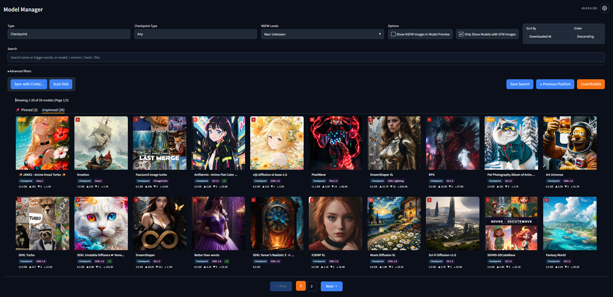

### Everything about a model, in one panel

Click a card for its trigger words, tags, description, creator, licence terms and the
NSFW breakdown of its gallery. Versions of the same model are grouped, and a selector
switches between them - including the versions you have not downloaded, as Civitai listed
them at the last sync, each with a Download.

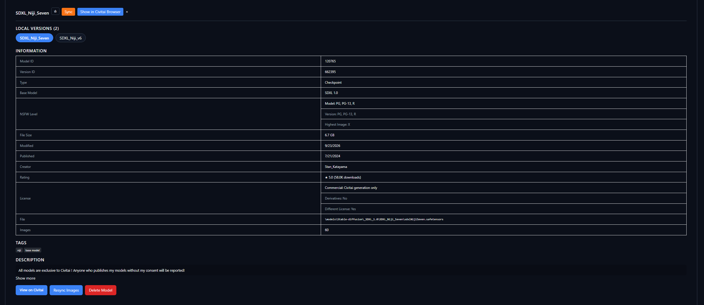

### Example images you can reuse

The model's Civitai gallery, with each image's prompt and settings. One click sends them
to txt2img, with the sampler, scheduler and VAE matched against what you have installed,
and the image's LoRAs and embeddings laid out as chips under the prompts: click one to
put it in the prompt or take it out, or to download it if you do not have it. A banner
says how many images are hidden as NSFW, for having no usable prompt, or both, with a
switch for each.

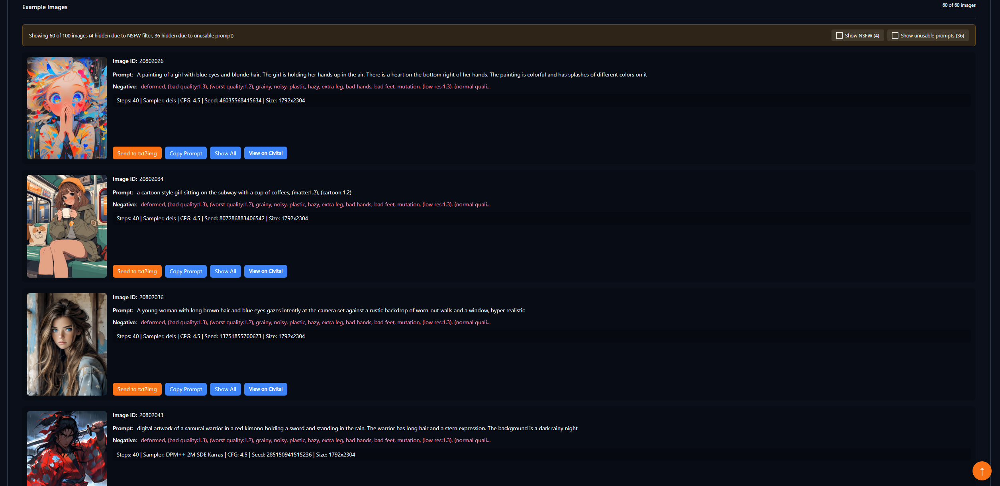

### Every image you generate

The **Generations** tab has every image you have generated and saved, newest first,
whatever model made it. A batch is one tile, opening onto its images; a click opens an
image large, with its prompt and settings, and the arrow keys step through them all.
**Group by** gathers images that share something - the prompt, as written or as
generated, the base model, the model, the LoRAs, the size, the day - or two of them: by
model, then prompt, each model is a row with its prompts under it. **Rate** sets an
image's NSFW level where the prompt got it wrong; **Select** ticks batches and images to
delete at once, the files too if you choose. Send puts an image back in txt2img or
img2img with the preset, checkpoint, text encoders and VAE it was made with.

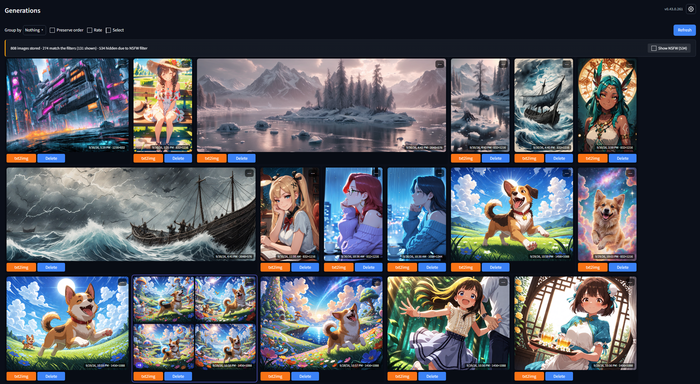

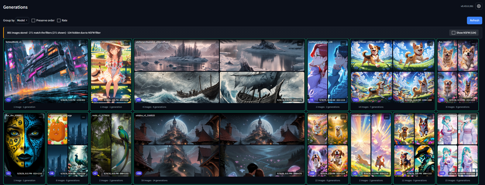

### Your own generations, by model

Beside a model's Civitai images, a tab of the images you have generated with it - with
the checkpoint, or with any LoRA, text encoder or VAE it used. Each generation is one
card: its image, or its batch as a grid, with the settings from its infotext. Send puts
them back in txt2img or img2img as Forge's PNG Info would; Delete, or Select for several,
removes the record, and the image files too if you tick the box beside it. Recording
starts once the extension is installed, and can be turned off in its settings.

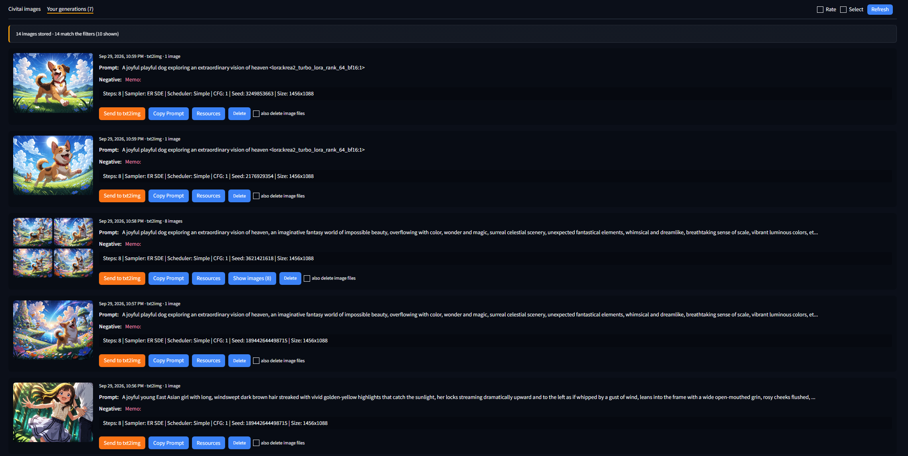

### Generations, queued for later

Press **Queue** beside Generate, in txt2img or img2img, and what Generate would run is
kept as a task: the checkpoint, VAE and text encoders, every setting, the scripts and their
arguments - an X/Y/Z plot, ControlNet's units with their images - and the images it was
given. The **Queue** tab runs the tasks one at a time, in the order they were queued, each
with its own checkpoint, while you go on working; it carries on with the page closed, and a
restart keeps the tasks. A bar along the running task shows how far along it is. **Pause**
lets it finish and starts no other; **Stop** ends it, keeping what it made. A click on a
task shows everything it holds, and **Load to UI** sets its tab up with it again; **Show
images** opens the Generations tab on the images it made. **Retry** queues a copy, with the
same seed or a random one, and **Select** ticks several to retry or delete at once.

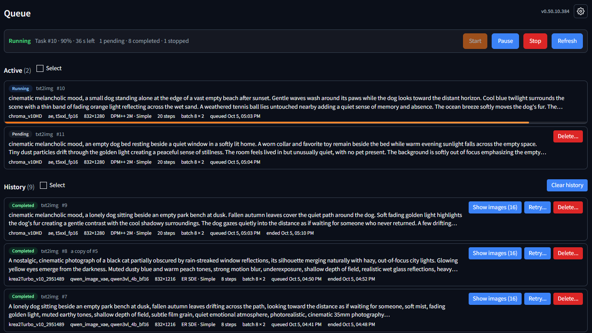

### Keeping it in sync

**Sync with Civitai** reads your model folders - adding new files, forgetting deleted ones -
identifies new files by hash and fetches their Civitai metadata, and says what it is about to
do before it does it.

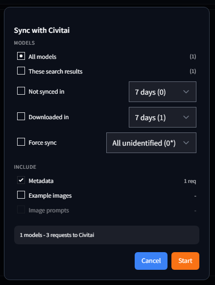

### Finding new models

Search Civitai without leaving the WebUI, by name, type, base model, tag and file size.
Models you already have are marked **Owned**, with a jump to them in the Model Manager.
Two checks Civitai cannot make are done here: **Only Show Models with SFW images** leaves out models
whose first example images include anything NSFW, and **Only with usable prompts** keeps
only models whose images have a prompt worth reusing. Results stream in as they are found.
Save Search keeps the search, and runs it the first time the tab is opened.

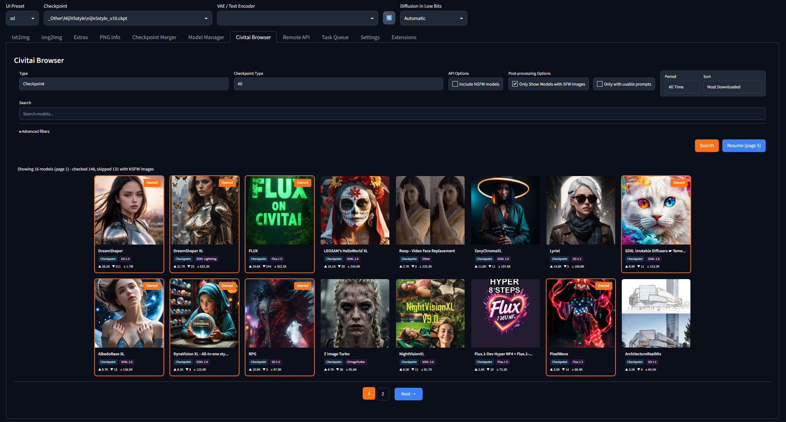

### Downloads you control

Downloads land in the folder for their model type, are checked against Civitai's
SHA-256, and are complete once the model is in your library, so it can be opened in the
Model Manager straight away. Two run at a time, each with its speed and the time it has
left. A waiting download can be started now, moved up or down, or cancelled; a running one
paused, and resumed from where it stopped - after a WebUI restart too. The list keeps its
order whatever each download is doing.

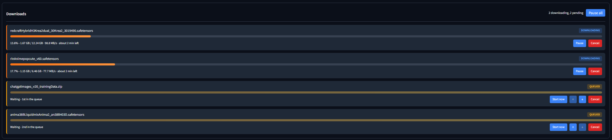

### Notes, and what is new

Each tab says, at its top, what is new since your last update and what to do about it -
a button does it where one helps, such as opening the sync dialog with the right box ticked.
Each tab also has an introduction, with buttons for its first steps. One click dismisses a note;
the settings window's **What's new** keeps them all. When a newer version is out, each
tab's header says so beside the version.

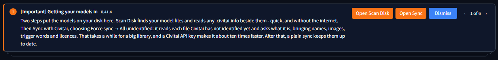

## Model Manager

Browse and organize the models already on disk.

- **Grid view** with thumbnails, configurable card size, and paginated loading
- **Filters**: search, type, base model, NSFW level (max or contains mode), Civitai data
  present, bookmarked, minimum version count, file size, and licence terms (commercial
  use, derivatives, different licence). **Save Search** keeps them, in the database, and
  the tab opens with them; a right-click on it forgets them
- **Pins**: pinned models get a **Pinned** tab above the grid, the rest an **Unpinned**
  one; a pin is kept by the model, or by the file for one Civitai does not know
- **Type from the file itself**: a sync reads each file's tensor names and shapes, so a
  VAE shared on Civitai as a "Checkpoint" is filed as a VAE, LoRA formats are told apart
  (LORA, LoCon, LoHa, LoKr, DoRA, LyCORIS Full), and files Civitai does not know get a
  type too. `.ckpt` and `.pt` files are read without running anything in them. Until a
  file has been read, its Civitai type is used
- **Sort** by name, file size, file modified, published, scanned, downloaded, updated,
  rating, or download count
- **Version grouping**: versions of the same model are grouped, with a version selector
  in the details panel. A card shows the newest you have; where two share a date, the one
  Civitai lists first. It lists every version Civitai has, as of the last sync, with the
  ones you have marked; one you do not have shows its details and a Download, followed in
  the same downloads panel as the Civitai Browser's
- **Details panel**: trigger words, tags, description, creator, rating, per-level NSFW
  breakdown, licence terms, and the full Civitai image gallery with generation parameters
- **Send to txt2img** from any gallery image, including sampler, scheduler, VAE,
  and resource matching against your installed models. For Flux, Qwen-Image, Wan and
  Forge Neo's other newer models it also switches the UI preset and selects the text
  encoders and VAE the model needs, read from the model file itself. In a LoRA's or a
  VAE's gallery that model is the image's own checkpoint when you have it, else the
  LoRA's, else the image's checkpoint as Civitai describes it (asked once, remembered)
- **Videos**: a Wan text-to-video example is sent with its frame count and size, read
  from the video. An image-to-video model goes to img2img instead, starting from the
  video's first frame (or the still, in its gallery), with denoising at 1
- **LoRA and embedding chips**: after a send, the image's LoRAs, LoCons and embeddings
  appear under the negative prompt, named as your files are - one chip per LoRA, however
  many ways the image names it. A click puts one in at the
  image's weight (0.5 when it gives none) or takes it out at any weight; an embedding
  goes to the prompt the image used it in. A LoRA the prompt names differently from
  your file is renamed to it. **Clear** removes the chips and leaves the prompts alone
- **Missing resources** can be downloaded from their chip or from the image's
  **Resources** dialog: the version the image used, or the model's newest if Civitai no
  longer has it. Resources Civitai does not know are shown as such, with nothing to click
- **Bookmarks**, per-model force re-sync, and model deletion (removes the model plus its
  sidecar metadata and preview files)
- **Sync** finds new model files on disk, and fetches their Civitai metadata by file hash

## Generations

Every image you generate, in one place. Recorded as Forge saves it, with the prompt as you
typed it and as each image was made, the infotext, every setting, and the LoRAs each
image of a batch used.

- **Grid** of batches and images, newest first, loading on as you scroll; **Preserve
  order** keeps every tile one column, strictly newest first
- **Search** the prompts and negative prompts, as generated or as typed: every word must be
  there, and a quoted phrase counts as one; `task:17` shows what task 17 of the queue made
- **Group by** prompt (as written or as generated), base model, model, LoRA combination,
  size or day - or two at once, from the menu's "then by" list: the first grouping is a
  row across the grid, the second its groups under it
- **Viewer**: the image large, its prompt and settings beside it, the arrow keys or the
  wheel through every image
- **Rate** an image's NSFW level, or a whole batch's, where its prompt misled the filter
- **Select** batches and images - shift-click for a range, Select all loaded - and delete
  them at once, asked once, the files too if you choose
- **Send** to txt2img or img2img, with the preset, checkpoint, text encoders and VAE the
  image was made with; **Show model in Model Manager**, from a tile's ⋯ menu, opens it there

## Queue

Generations kept to run later, one at a time, while you go on working.

- **Queue**, beside Generate in txt2img and img2img: what Generate would run, kept as a
  task - the checkpoint, VAE and text encoders, every setting, the scripts and their
  arguments, ControlNet's units with their images, and the images it was given
- **Start** runs the pending tasks in the order they were queued, each with its own
  checkpoint, VAE and text encoders, through Forge's own Generate: its progress, scripts and
  saving all apply. A task whose checkpoint or VAE is gone fails rather than run on another.
  The queue carries on with the page closed; a restart leaves it stopped, the tasks kept
- **Pause** lets the running task finish and starts no other until **Resume**; **Stop**
  ends it, keeping the images it made. Forge's own Interrupt stops the task, and the queue
  goes on
- **Active** and **History**: what each task asks for - checkpoint, VAE, size and hires
  fix, sampler, steps, batch - and how many images it made; the running one has a bar
  showing how far along it is
- A click on a task shows everything it holds; **Load to UI** sets its tab up with it
  again, checkpoint and VAE included; **Show images** opens the Generations tab on what it
  made
- **Retry** queues a copy, with the first run's seed or a random one; **Delete** removes a
  task, with the images it made or without; **Select** ticks several, shift-click for a
  range; **Clear history** hides the ended tasks
- A task that uses an extension no longer installed asks before it runs: without it, or
  not at all
- **Generate asks first** when it would make more than 4 images - batch count times batch
  size, a setting: generate, queue the run instead, or cancel
- Your own generations go first: the queue waits for them before each task
- Two WebUIs sharing one database each keep a queue of their own

## Civitai Browser

Search Civitai and download directly into the right model folder.

- Search by query, type, base model, tag, period, file size and sort order, with results
  streamed in as they are found; **Save Search** keeps the search, and runs it the first
  time the tab is opened
- **Ownership detection**: models you already have are marked as owned, with a
  "Show in Model Manager" jump
- **Usable-prompt filter**: only show models whose images carry a prompt plus
  steps/sampler/CFG
- Image gallery read live from Civitai, a page at a time, with Load More
- **Downloads**, shared with the Model Manager: two at a time, with progress, speed and
  time left; a waiting one started now, moved up or down, or cancelled; a running one
  paused and resumed from where it stopped, after a restart too; Pause all and Resume all.
  A configurable destination folder template, a SHA-256 check against Civitai's, the
  model added to your library before the download counts as complete, and a WebUI
  model-list refresh

## Installation

1. Open SD WebUI Forge
2. Go to **Extensions** -> **Install from URL**
3. Paste: `https://github.com/therestlesscat/sd-webui-forge-model-manager.git`
4. Click **Install**
5. Restart the WebUI

`blake3` is installed automatically on first run; it is optional and only used as a hash
fallback.

**Updating**: each tab's header says when a newer version is out, beside the version.
Update from **Extensions -> Check for updates**, then **Apply and restart UI**. A note at
the top of a tab says if an update asks for anything - a sync with every header read again, say. If
Forge Neo and the original Forge share one database, update the extension in both before
starting either.

## Usage

1. Open the **Model Manager** tab. Its introduction, at the top, walks you through the
   first steps, with buttons for them
2. Click **Sync** to read the models on disk and fetch their Civitai metadata
3. Set your filters and click **Load Models**
4. Click any model card to open its details
5. Generate as usual: the images appear in the **Generations** tab, and under each model
   they used

## Settings

In the settings window - the gear at the top right of each tab - grouped by what they
are for, or under **Settings -> Model Manager**. Both edit the same values. Each tab's
switch comes first, in the window's Tabs section: a tab switched off does nothing at all,
and the window shows only the sections of the tabs that are on. One switched back on that
needs a page reload or Reload UI to return says so, and offers it - beside **Restart WebUI**,
which starts the server and the page afresh for the cleanest slate, where the WebUI was
started by its own script. With every tab off, the window goes with them: the switches come
first under **Settings -> Model Manager** too.

| Setting | Default | Description |
|---------|---------|-------------|
| Queue | on | A Queue button beside Generate, in txt2img and img2img, keeps the generation as a task, and the Queue tab runs the tasks. Off: the tab and the buttons are hidden at once, a running queue stops, and from the next start neither is created. The tasks are kept |
| Your generations | on | Records every txt2img and img2img result saved to disk, for the Generations tab and each model's Your generations. Off: nothing is recorded, both are hidden at once, and the Generations tab is not created from the next start. What was recorded is kept |
| Model Manager tab | on | Your models, their details and galleries, and the sync with Civitai. Off: the tab is hidden at once and stops, and from the next start it is not created at all; a sync already running finishes. Your library is kept, and downloads still add to it |
| Civitai Browser tab | on | Searching Civitai, and downloading from it. Off: the tab is hidden at once and stops, and from the next start it is not created at all; downloads already running finish |
| Civitai API Key | empty | Optional. Higher rate limits for Civitai API requests; without one, image prompts cannot be fetched and some models refuse to download |
| Model Manager: Models per page | 20 | Model Manager page size (5-50) |
| Custom Database Path | empty | Full path to the database file. Empty uses the extension folder. Requires restart |
| Model Manager: card thumbnail is the least explicit image | on | Off shows the most recent image instead |
| Image gallery: hide explicit images by default | on | How a model's image gallery opens, in both tabs. The Show NSFW switch above the images shows them for that model |
| Civitai Browser: Models per page | 20 | Civitai Browser page size (5-50) |
| Example images: hide the ones with no prompt | on | Hides images with no prompt to read or reuse. Can be turned back on per model from the banner above the images |
| Queue: folder for the images a task needs | empty | Where a queued task keeps the images it was given - an img2img source and mask, ControlNet's images - one folder per task, until the task is deleted. Empty: `queue-inputs` in the WebUI's folder, beside `outputs` |
| Queue: ask "Generate N images?" above this many images | 0 | Batch count times batch size. Above it, Generate asks whether to generate, queue the run instead, or cancel; each browser can be told not to ask again. 0: Generate never asks |
| Image gallery: images per page | 100 | How many stored images each page of a gallery takes (10-200), before the NSFW and prompt filters. Load More adds the next page, fetched from Civitai when the library holds too few. Shared by both tabs and your generations |
| Gallery images: load as uploaded, not resized | off | Gallery images load as the upload instead of a copy the size they are drawn: sharper on a large screen, and much larger - in one measurement 3.6 MB an image against 54 KB - but often quicker the first time a gallery is opened: Civitai seldom has a copy ready, and takes about half a second to make each. Videos stay copies, which always play. The image viewer shows the upload either way |
| Model cards: load as uploaded, not resized | off | The same for the cards in both tabs' grids |
| Civitai Browser: Download folder template | `_{baseModel}/{modelName}` | Placeholders: `{baseModel}`, `{modelName}`, `{creator}`, `{modelId}` |
| Civitai: Requests per second | 6 | API call rate when an API key is set (1-10). Applies to the next search, download or sync |
| Sync: Hashing threads | 4 | Files hashed at once when identifying them (1-16). Raise for fast NVMe, lower for a spinning disk |
| Civitai Browser: Minimum images with usable prompt | 1 | How many of a model's first 20 images need a usable prompt for "Only with usable prompts" |
| Civitai Browser: Fill every page with 'Only Show Models with SFW images' | off | Not recommended. Keeps searching until the page is full instead of stopping after a few dozen checks; one page can take hundreds of requests |
| Model Manager: Card size | `200x280` | Card size in pixels, `WIDTHxHEIGHT` |
| Civitai Browser: Card size | `200x280` | Card size in pixels, `WIDTHxHEIGHT` |
| NSFW: extra prompt words | empty | Words added to the bundled list. An image rated PG or PG-13 whose prompt uses one is treated as X. Stored images are judged again in the background when this changes |
| NSFW detection | Trained model | What finds explicit images Civitai rates PG or PG-13: the trained model, which catches more and is sometimes wrong, or the word list alone. While the model is in use, the galleries' filter banner and "Only Show Models with SFW images" say so. Stored images are judged again in the background when this changes |
| NSFW: trained model - % of PG/PG-13 prompts to treat as X | 2 | How far the prompt model goes (0-20). 2 caught about 94% of X/XXX prompts on a library the model had never seen; 1 is stricter, higher catches more at more cost, 0 turns it off. Stored images are judged again in the background when this changes |
| Check for a new version | on | After the WebUI starts, and every 12 hours, reads `version.json` on this repository's GitHub - the version it holds, nothing else - and each tab's header says when a newer one is out. Off: GitHub is never asked |
| Send to txt2img: *model* text encoders and VAE | empty | One per Forge Neo preset: Flux.1 / Chroma, Flux.2 Klein, Lumina Image 2.0, Z-Image, Anima, Wan, Qwen-Image, Krea 2, ERNIE-Image, PiD. File names to select for that preset's models, comma-separated. Empty picks the highest-precision file installed; name an fp8 or GGUF file to use a smaller one. Each setting says what the model needs and links to the files |

### Text encoders and VAEs for newer models

Flux, Qwen-Image, Wan and the other newer models Forge Neo runs need text encoders and a
VAE that an image's generation data never names. Put text encoders in
`models/text_encoder` and VAEs in `models/VAE`. Forge Neo's
[Download Models](https://github.com/Haoming02/sd-webui-forge-classic/wiki/Download-Models)
page lists them all.

| Preset | Needs |
|--------|-------|
| Flux.1 / Chroma | CLIP-L, T5-XXL, Flux VAE (`ae`). Chroma: T5-XXL and `ae` only |
| Flux.2 Klein | Qwen3 4B (4B) or Qwen3 8B (9B), Flux.2 VAE |
| Lumina Image 2.0 | Gemma 2 2B, Flux VAE (`ae`) |
| Z-Image | Qwen3 4B, Flux VAE (`ae`) |
| Anima | Qwen3 0.6B, Qwen-Image VAE |
| Wan | UMT5-XXL (Hugging Face layout), Wan 2.1 VAE |
| Qwen-Image | Qwen2.5-VL 7B, Qwen-Image VAE |
| Krea 2 | Qwen3-VL 4B, Qwen-Image VAE |
| ERNIE-Image | Ministral 3 3B, Flux.2 VAE |
| PiD | Gemma 2 2B IT; the VAE depends on the model |

When nothing is set, Send to txt2img uses Forge's saved choice for the preset if it is
the right kind of file, and otherwise the file with the highest precision. A file named in
the settings comes before both. A missing module, or a named file Forge does not list, is
reported in a notice.

## Data storage

Metadata lives in a SQLite database (`models.db` in the extension folder by default),
with your generations, your pins and saved searches, the downloads waiting to be resumed,
the queue's tasks, and which notes you have dismissed. The images a queued task was given
are files in `queue-inputs`, in the WebUI's folder unless the settings name another, and
are deleted with the task.
Before an update that rebuilds one of its tables, a copy is written beside it
(`models.db.backup_<date>_<time>`). Forge Neo and the original Forge can share one
database; keep the extension at the same version in both. Sidecar files written next to
each model stay compatible with other Civitai extensions:

```
model.safetensors
model.civitai.info     <- model + version metadata
model.preview.png      <- thumbnail
```

## NSFW levels

The extension uses Civitai's NSFW levels: PG, PG-13, R, X, XXX, Blocked.

The effective level for a model is the maximum of:

- Model-level NSFW rating
- Version-level NSFW rating
- Highest image NSFW rating

Civitai's raters miss some images. An image rated PG or PG-13 whose prompt reads as
explicit is treated as X everywhere: grid previews, both galleries, and the SFW filters.
Its badge reads "X · prompt". Two things decide it - or, with **NSFW detection** set to
Word list, the words alone:

- **A prompt model**, trained on image prompts - their words, pairs of words, negative,
  ADetailer and hires prompts, and the resources they used - to tell the prompts of images
  Civitai rates X or XXX from PG or PG-13 ones. It was trained on 762,000 prompts from the
  thousand Civitai models with the most images. The setting says how far it goes, as the
  share of PG/PG-13 prompts it may raise: at the default 2 it caught about 94% of X/XXX
  prompts on a library it had never seen, where a word list caught 81%. It ships as
  `model_manager/data/nsfw_prompt_model.json.gz`, which holds no words, only their hashes;
  `tools/run_nsfw_training.sh` trains it again from Civitai, and `tools/train_nsfw_model.py`
  from a library.
- **A short list of explicit words**, in `model_manager/data/nsfw_prompt_words.txt`, plus
  any you add in the settings. Only the positive prompt is read, and only whole words.

Stored images are judged again in the background whenever the words, the model or its
setting change, from the prompts already stored, so no sync is needed. An image whose
prompt was never fetched keeps Civitai's rating.

## License

MIT License - see [LICENSE](LICENSE).
